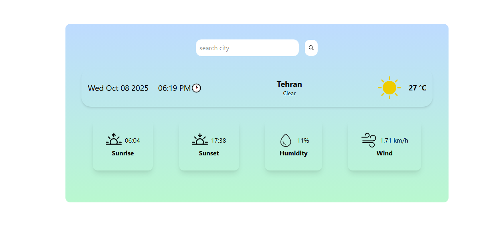

# Weather App ☀️🌧

 
 

 #### *A weather app built using JavaScript and API*

## list of contents
- [Introduction](#Introduction)
- [Installation](#Installation)
- [Features](#Features)
- [Technologies Used](#Technologies-Used)
- [Preview](#Preview)
- [Roadmap](#Roadmap)
- [License](#License)
- [Contact](#Contact)


## Introduction
 This app displays the weather information for cities around the world. Enter the city name in the search bar and click the search button to get details such as temperature, weather conditions, wind speed, and humidity percentage.

The app uses the OpenWeather API : [ OpenWeather ](https://openweathermap.org)

## Installation
 1- Clone the repository  
  ```bash
  git clone https://github.com/ParvinBahram/wheather-app.git
  ```

 2- Be sure Node.js is installed on your system.


 3- Navigate to the project directory :
```bash 
cd repository-name
```

 4- In terminal, install dependency to create node modules folder:
  ```bash
    npm i
```

### 5- Run the project
```bash
npm run dev 
```

## Features
1- The app is responsive and  built with a mobile-first approach.

2- Case-insensitive city search, it works correctly whether letters are uppercase or lowercase.


## Technologies Used
 Built with **HTML** , **CSS** ,**JavaScript** , **Tailwind Css** .

## Preview



## Roadmap
I am going to extend the app by adding local time, date, and animation features.

## License
No license restrictions — free to use for everyone.

## Contact

📧 Email: example@email.com
